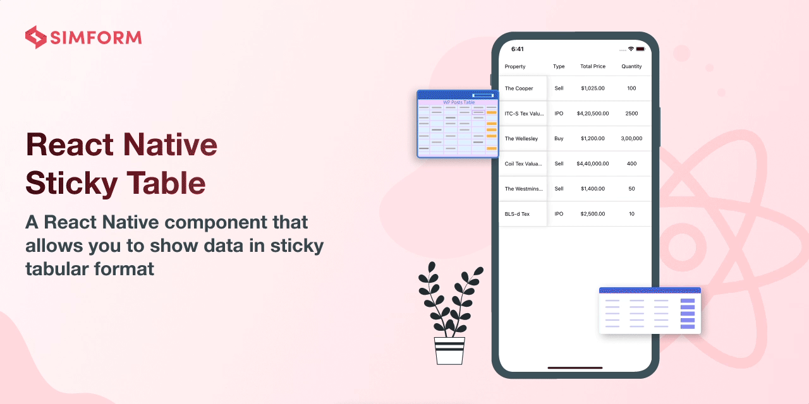
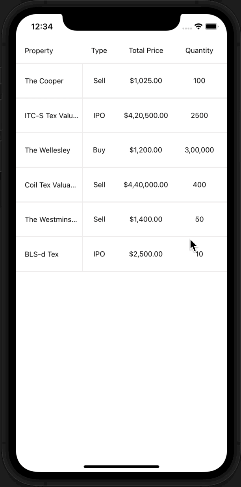
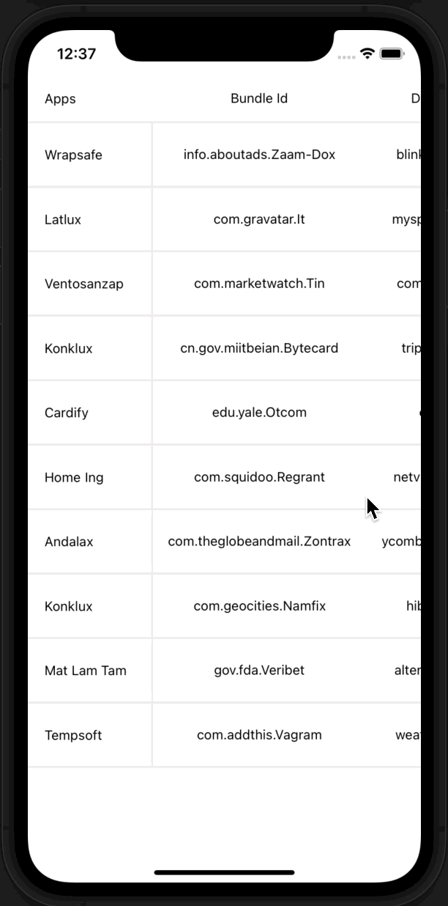

# react-native-sticky-table

[](https://www.npmjs.com/package/react-native-sticky-table) [](https://www.npmtrends.com/react-native-sticky-table) [](https://packagephobia.com/result?p=react-native-sticky-table) [](https://www.android.com) [](https://developer.apple.com/ios) [](https://opensource.org/licenses/MIT)

---

Sticky Table library is built purely in JavaScript and React Native Reanimated represented to make better your sticky table experience by enabling horizontal and vertical scrolling.

Our user-friendly and highly customizable library ensures a seamless experience. Whether you're an Android or iOS user, our library is compatible with both platforms, guaranteeing optimal performance.

---

## 🎬 Preview

---

| Stock Info Sticky Table                                                                                                                                                  | App Info Sticky Table                                                                                                                                                       |
| ------------------------------------------------------------------------------------------------------------------------------------------------------------------------ | --------------------------------------------------------------------------------------------------------------------------------------------------------------------------- |
| <a href="https://github.com/SimformSolutionsPvtLtd/react-native-recipe-sample"> </a> | <a href="https://github.com/SimformSolutionsPvtLtd/react-native-recipe-sample"> </a> |

---

## Quick Access

[Installation](#installation) | [Usage and Examples](#usage) | [Properties](#properties) | [Example](#example) | [License](#license)

## Getting Started 🔧

Here's how to get started with react-native-sticky-table in your React Native project:

### Installation

##### 1. Install the package

```sh
npm install react-native-sticky-table react-native-reanimated react-native-gesture-handler lodash
```

###### --- or ---

```sh
yarn add react-native-sticky-table react-native-reanimated react-native-gesture-handler lodash
```

##### 2. Install cocoapods in the ios project

```bash
cd ios && pod install
```

> Note: Make sure to add Reanimated's babel plugin to your `babel.config.js`

```js
module.exports = {
      ...
      plugins: [
          ...
          'react-native-reanimated/plugin',
      ],
  };
```

##### Know more about [react-native-reanimated](https://www.npmjs.com/package/react-native-reanimated), [react-native-gesture-handler](https://www.npmjs.com/package/react-native-gesture-handler) and [lodash](https://lodash.com/)

## Usage

#### Type of Data

```jsx
const data = {
  titleData: Array<string>,
  tableData: Array<{
    data: Array<string>,
    maxWidth?: number
  }>
};
```

#### Sample Data

```jsx
const data = {
  titleData: ['Property', 'The Cooper', 'ITC-S Tex Valuable'],
  tableData: [
    {
      maxWidth: 50,
      data: ['Type', 'Sell', 'IPO'],
    },
    {
      data: ['Total Price', '$1,025.00', '$4,20,500.00'],
    },
    {
      data: ['Quantity', '100', '2500'],
    },
    {
      data: ['High', '$1,325.00', '$4,22,513.00'],
    },
    {
      data: ['Low', '$1,005.00', '$4,00,513.00'],
    },
    {
      data: ['Market-Return', '21%', '40%'],
    },
    {
      data: ['Status', 'Active', 'Inactive'],
    },
  ],
};
```

#### Basic Example

```jsx
import React from 'react';
import { SafeAreaView, StyleSheet } from 'react-native';
import { StickyTable } from 'react-native-sticky-table';

const App = () => {
  const data = {
    titleData: [
      'Property',
      'The Cooper',
      'ITC-S Tex Valuable',
      'The Wellesley',
      'Coil Tex Valuable',
      'The Westminster',
      'BLS-d Tex',
    ],
    tableData: [
      {
        data: ['Type', 'Sell', 'IPO', 'Buy', 'Sell', 'Sell', 'IPO'],
      },
      {
        data: [
          'Total Price',
          '$1,025.00',
          '$4,20,500.00',
          '$1,200.00',
          '$4,40,000.00',
          '$1,400.00',
          '$2,500.00',
        ],
      },
      {
        data: ['Quantity', '100', '2500', '3,00,000', '400', '50', '10'],
      },
      {
        data: [
          'High',
          '$1,325.00',
          '$4,22,513.00',
          '$1,212.00',
          '$4,41,110.00',
          '$1,445.00',
          '$2,535.00',
        ],
      },
      {
        data: [
          'Low',
          '$1,005.00',
          '$4,00,513.00',
          '$1,000.00',
          '$3,90,110.00',
          '$925.00',
          '$2,035.00',
        ],
      },
      {
        data: ['Market-Return', '21%', '40%', '2%', '34%', '1%', '90%'],
      },
      {
        data: [
          'Status',
          'Active',
          'Inactive',
          'Active',
          'Active',
          'Inactive',
          'Inactive',
        ],
      },
    ],
  };

  return (
    <SafeAreaView style={styles.screen}>
      <StickyTable
        data={data}
        rowTitleProps={{
          removeProperty: 'The',
          titleBackgroundColor: 'white',
        }}
      />
    </SafeAreaView>
  );
};

export default App;

const styles = StyleSheet.create({
  screen: {
    flex: 1,
  },
});
```

#### 🎬 Preview

## <a href="https://github.com/SimformSolutionsPvtLtd/react-native-sticky-table"> </a>

## Properties

| Props           | Default |                   Type                    | Description                                                                      |
| --------------- | :-----: | :---------------------------------------: | -------------------------------------------------------------------------------- |
| **data**        |    -    |     [StickyTableData](#type-of-data)      | Data to render in tabular format                                                 |
| maxWidth        |   132   |                  number                   | maximum width of rowTitle                                                        |
| minWidth        |   104   |                  number                   | minimum width of rowTitle                                                        |
| flatListProps   |    -    | FlatListProps<[ArrayData](#type-of-data)> | Provide <a href="https://reactnative.dev/docs/flatlist#props">flatlist props</a> |
| scrollViewProps |    -    |              ScrollViewProps              | props of the scroll view                                                         |
| containerStyle  |    -    |          `StyleProp<ViewStyle>`           | style of the container                                                           |
| containerProps  |    -    |                 ViewProps                 | props of the container                                                           |
| rowTitleProps   |    -    |      [RowTitleProps](#rowtitleprops)      | Row title props contain all the customizable props                               |
| tableItemProps  |    -    |     [TableItemProps](#tableitemprops)     | Table item props contain all the customizable props for table item               |

---

##### RowTitleProps

| Props                      | Default |              Type              | Description                        |
| -------------------------- | :-----: | :----------------------------: | ---------------------------------- |
| firstIndexContainerStyle   |    -    | `AnimatedStyleProp<ViewStyle>` | style of the first index container |
| otherIndexContainerStyle   |    -    | `AnimatedStyleProp<ViewStyle>` | style of the container             |
| containerStyle             |    -    | `AnimatedStyleProp<ViewStyle>` | style of the other index container |
| containerProps             |    -    |   `AnimateProps<ViewProps>`    | props of the container             |
| titleBackgroundColor       |    -    |             string             | background color of the title      |
| separatorViewStyle         |    -    |     `StyleProp<ViewStyle>`     | style of the separator             |
| firstWordContainerStyle    |    -    | `AnimatedStyleProp<ViewStyle>` | style of the first word container  |
| firstWordTextProps         |    -    |   `AnimateProps<TextProps>`    | props of the first word text       |
| lastWordContainerStyle     |    -    | `AnimatedStyleProp<ViewStyle>` | style of the last word container   |
| lastWordTextProps          |    -    |   `AnimateProps<TextProps>`    | props of the last word text        |
| removeProperty             |    -    |             string             | property to remove from the data   |
| rowTitleSeparatorViewStyle |    -    |     `StyleProp<ViewStyle>`     | style of the row title separator   |
| rowTitleSeparatorViewProps |    -    |           ViewProps            | props of the row title separator   |

---

##### TableItemProps

| Props                    | Default |          Type          | Description                        |
| ------------------------ | :-----: | :--------------------: | ---------------------------------- |
| renderItemContainerStyle |    -    | `StyleProp<ViewStyle>` | style of the column container      |
| renderItemContainerProps |    -    |       ViewProps        | props of the column container      |
| separatorViewStyle       |    -    | `StyleProp<ViewStyle>` | style of the separator             |
| separatorViewProps       |    -    |       ViewProps        | props of the separator             |
| columnTitleStyle         |    -    | `StyleProp<ViewStyle>` | style of the column title          |
| columnItemStyle          |    -    | `StyleProp<ViewStyle>` | style of the column item           |
| columnCommonItemStyle    |    -    | `StyleProp<ViewStyle>` | style of the column common item    |
| columnItemContainerProps |    -    |       ViewProps        | props of the column item container |
| columnItemTextStyle      |    -    | `StyleProp<TextStyle>` | style of the column item text      |
| columnItemTextProps      |    -    |       TextProps        | props of the column item text      |

##### Know more about [ViewProps](https://reactnative.dev/docs/view#props), [ViewStyle](https://reactnative.dev/docs/view-style-props), [FlatListProps](https://reactnative.dev/docs/flatlist#props), [TextProps](https://reactnative.dev/docs/text#props), [TextStyle](https://reactnative.dev/docs/text-style-props#props)

---

## Example

A full working example project is here [Example](./example/src/App.tsx)

```sh
yarn
yarn example ios   // For ios
yarn example android   // For Android
```

## Find this library useful? ❤️

Support it by joining [stargazers](https://github.com/SimformSolutionsPvtLtd/react-native-sticky-table/stargazers) for this repository.⭐

## Bugs / Feature requests / Feedbacks

For bugs, feature requests, and discussion please use [GitHub Issues](https://github.com/SimformSolutionsPvtLtd/react-native-sticky-table/issues/new?labels=bug&late=BUG_REPORT.md&title=%5BBUG%5D%3A), [GitHub New Feature](https://github.com/SimformSolutionsPvtLtd/react-native-sticky-table/issues/new?labels=enhancement&late=FEATURE_REQUEST.md&title=%5BFEATURE%5D%3A), [GitHub Feedback](https://github.com/SimformSolutionsPvtLtd/react-native-sticky-table/issues/new?labels=enhancement&late=FEATURE_REQUEST.md&title=%5BFEEDBACK%5D%3A)

## 🤝 How to Contribute

We'd love to have you improve this library or fix a problem 💪
Check out our [Contributing Guide](CONTRIBUTING.md) for ideas on contributing.

## Awesome Mobile Libraries

- Check out our other [available awesome mobile libraries](https://github.com/SimformSolutionsPvtLtd/Awesome-Mobile-Libraries)

## License

- [MIT License](./LICENSE)
